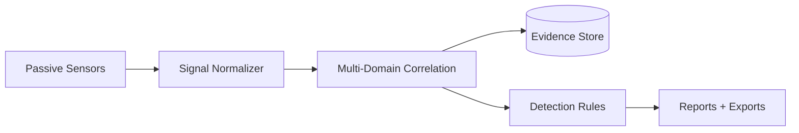
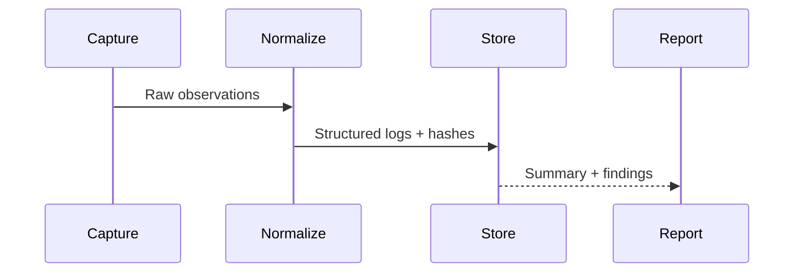

# TraceLock - Multi-Domain RF Threat Detection (Public Overview)

TraceLock is a defensive, passive RF telemetry platform for multi-domain wireless awareness. This public repository is a redacted overview that demonstrates detection engineering and evidence-grade logging without exposing sensitive methods or operational details.

## What This Is
- Passive signal observation across Wi-Fi, BLE, SDR, GPS, and ADS-B
- Evidence-grade logging with integrity checks and structured outputs
- Detection engineering focused on correlation, not active interference

## Domains Covered (Defensive)
- Wi-Fi (beacons, probe patterns, rogue AP indicators)
- BLE (advertisement density, device class patterns)
- SDR (wideband spectrum context)
- GPS (signal quality anomalies)
- ADS-B (aircraft proximity context)

## High-Level Architecture (Redacted)

## Evidence Pipeline (Redacted)

## Example Outputs (Synthetic)
- `examples/trace-lock-scan-summary.json`
- `examples/detection-report.md`

## CI/CD (Private Repo)
This public overview mirrors a private repo with automated workflows:
- CI: lint + smoke tests for core modules
- Gates: compile checks and basic entrypoint validation
- Hygiene: dependency install and runtime guards

## Safety and Scope
- Defensive-only, passive observation
- No jamming, no interference, no device targeting
- No real device identifiers or addresses in public artifacts

## Disclaimer
This is a public-safe overview. Do not use as a production system. No sensitive data or operational details are included.
